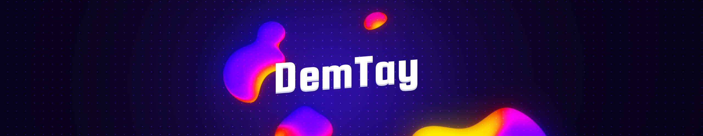

<h2 align="left">Hi 👋! My name is DemTay and I'm a french apprentice developer</h2>

  
  
  
  
  
  
  
  
  
  
  
  
  

###

<picture>
  <source media="(prefers-color-scheme: dark)" srcset="https://raw.githubusercontent.com/DemTay/DemTay/output/github-snake-dark.svg" />
  <source media="(prefers-color-scheme: light)" srcset="https://raw.githubusercontent.com/DemTay/DemTay/output/github-snake.svg" />
  
</picture>

###
